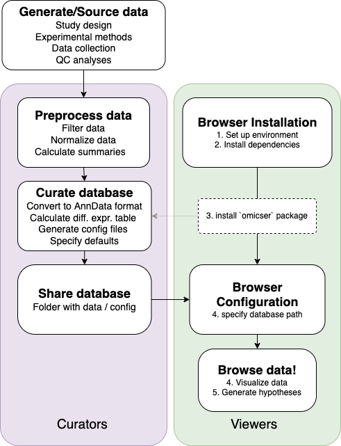

<!-- README.md is generated from README.Rmd. Please edit that file -->

```{r, include = FALSE}
knitr::opts_chunk$set(
  collapse = TRUE,
  comment = "#>",
  fig.path = "man/figures/README-",
  out.width = "100%"
)
```

# NDCN -Omics Browser (name TBC)

<!-- badges: start -->
[](https://lifecycle.r-lib.org/articles/stages.html#experimental)
<!-- badges: end -->


## Introduction

The goal of this package is to allow exploration of -omics data using
an interactive  Shiny app based "playground", which is accessable through an  web browser.
In addition to the browser package, this project includes documentation about usage, and a series of example scripts (`examples/`) which serve as a tutorial to demonstrate how it is to be used.
The browser package itself contains the code to create/run the browser,
as well as a small collection of helper functions to aid in curating and configuring datasets for browsing.

> *Note*:  although the NDCN Omics Browser is not yet officially named, references it as `omicser` or `omxr`. We are open to ideas around naming the tool.

There are two types of users for this package:

- **Curators**: data owners who prepare datasets for viewing. These individuals should be fairly proficient with R coding, including familiarity with building Shiny apps and knowledgeable about -omics data structures.
- **Viewers**: scientists who are interested in exploring -omics data using the application. They do not require extensive knowledge about R, but may need to have it installed if they are running the app on their own computer.

The diagram below summarizes the steps required to use this package:



Support for the following _post-QC_ -omics data types has been tested:

- _transcript_-omics
- _prote_-omics
- _metabol_-omics
- _lipid_-omics

The package is able to provide the following outputs:

- images visualizing data
- subsets of data
- web application packaged with data that can be shared with collaborators

## Installation and usage

This package was developed to create a [`Shiny`](https://shiny.rstudio.com/) application using  
[`{golem}`](https://github.com/ThinkR-open/golem), "an opinionated framework for building production-grade shiny applications."
It requires a number of additional R and Python packages.  The package creates the Shiny browser app as well as several functions for curating and packaging the data being curated.

> **If you would like an overview of the features and functionality of the browser, please view the [Browsing vignette](https://ndcn.github.io/omicser/articles/browsing.html).**

The remaining [vignettes](https://ndcn.github.io/omicser/articles/00_quickstart.html) 
are designed to walk Curators through the process of installing necessary software, curating data, creating an application, and launching the tool.

## Contributing to this project

This project began as part of the CZI NDCN Open Science Initiative Data Science Pilot (March-Sept 2021).

Please see our [Contributing guidelines](CONTRIBUTING.md)
for more information on any of the following:

- reporting bugs and problems using the software
- requesting additional features and functionality
- submitting your own code or documentation to become a part of this project
- sharing information about how you've used this package in your own work

Anyone interacting with our project is expected to follow our [Code of Conduct](CODE_OF_CONDUCT.md).

### Roadmap

Please view our [issues](https://github.com/ndcn/omicser/issues),
especially those tagged as [high priority](https://github.com/ndcn/omicser/issues?q=is%3Aopen+is%3Aissue+label%3A%22high+priority%22),
for more information about immediate plans for development.
